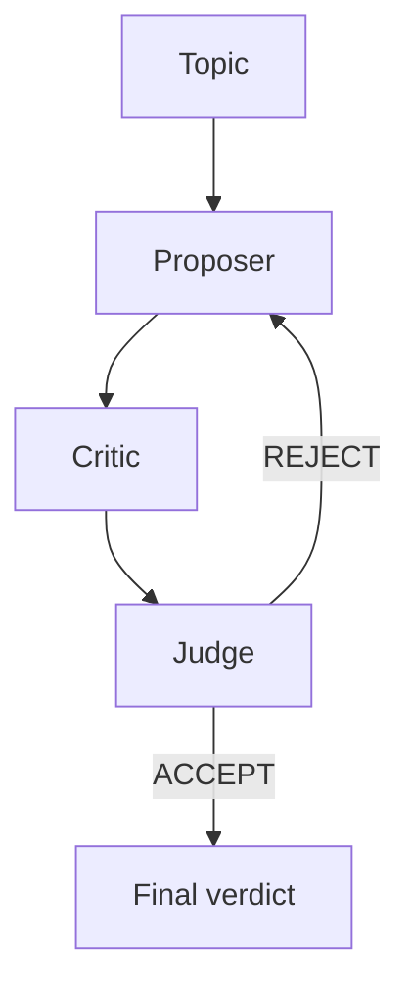

# Architecture

Three agents, each with isolated memory:

| Agent | Role |
|---|---|
| **Proposer** | Argues for the topic |
| **Critic** | Argues against, attacks proposer's claims |
| **Judge** | Decides ACCEPT or REJECT after each round |

The loop terminates when the judge accepts or max rounds are reached.
